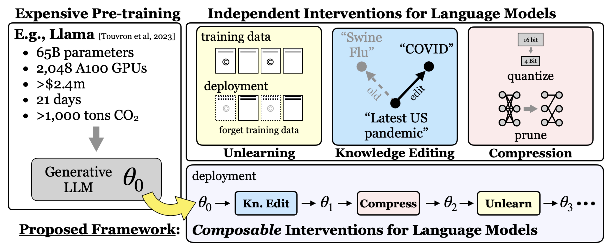

# Intervention Composability Evaluation Harness

 

 Read our **[paper](TODO)** for more details!

 ## Overview

Test-time interventions for language models aim to enhance factual accuracy, reduce harmful outputs, and improve model efficiency, all while avoiding excessive training costs. However, existing interventions are developing independently. Often, in practice, multiple interventions must be applied to the same model sequentially. `lm-compose` provides an end-to-end framework for defining, executing, and evaluating intervention compositions on language models. 

### Features
- Support for composing sequential interventions across model editing, unlearning, and compression.
- Evaluation for model performance, unlearning, knowledge editing, and compression.
- Load models via HuggingFace's [Transformers](https://huggingface.co/docs/transformers/en/index).
- Config-driven experiments via [Hydra](https://hydra.cc/).
- Log results to [Weights & Biases](https://wandb.ai/site).

### Supported Interventions
| Technique | Category | Introduced | 
|-----------|----------|------------|
| Fine-tune | Editing | NA | 
| MEMIT | Editing | [Mass-Editing Memory in a Transformer (Meng et al., (2022))](https://www.semanticscholar.org/paper/Mass-Editing-Memory-in-a-Transformer-Meng-Sharma/2fe1ac0b09cc0f50eb83eef6c7c6b45ac8b12413) | 
| LoRA | Editing | [LoRA: Low-Rank Adaptation of Large Language Models (Hu et al., (2021))](https://www.semanticscholar.org/paper/LoRA%3A-Low-Rank-Adaptation-of-Large-Language-Models-Hu-Shen/a8ca46b171467ceb2d7652fbfb67fe701ad86092) | 
| RMU | Unlearning | [The WMDP Benchmark: Measuring and Reducing Malicious Use With Unlearning (Li et al., (2024))](https://www.semanticscholar.org/paper/The-WMDP-Benchmark%3A-Measuring-and-Reducing-Use-With-Li-Pan/06b9ad0b52d23231f650be0aeb0b17cc52c8a74b) |
| GPTQ | Compression | [GPTQ: Accurate Post-Training Quantization for Generative Pre-trained Transformers (Frantar et al., (2022))](https://www.semanticscholar.org/paper/GPTQ%3A-Accurate-Post-Training-Quantization-for-Frantar-Ashkboos/7da0f2501034522e3d50af7e9b8fa7ec9d7b65b6) | 
| AWQ | Compression | [AWQ: Activation-aware Weight Quantization for LLM Compression and Acceleration (Lin et al., (2023))](https://www.semanticscholar.org/paper/AWQ%3A-Activation-aware-Weight-Quantization-for-LLM-Lin-Tang/42d4a37b25f0f0afc6a6580427a6418a17b86322) | 
| Wanda | Compression | [A Simple and Effective Pruning Approach for Large Language Models (Sun et al., (2023))](https://www.semanticscholar.org/paper/A-Simple-and-Effective-Pruning-Approach-for-Large-Sun-Liu/7d22ad3573101337bca2091fb0114b377c4f3db6) | 
| SparseGPT | Compression | [SparseGPT: Massive Language Models Can Be Accurately Pruned in One-Shot (Frantar et al., (2023))](https://www.semanticscholar.org/paper/SparseGPT%3A-Massive-Language-Models-Can-Be-Pruned-in-Frantar-Alistarh/909ad57ce8caa6b390a65ae09db352d27d8f3996) | 


# Install

This framework has been tested with Python 3.11. It's recommended that you use a virtual environment. 
```bash
conda create -n lm-compose python=3.11
```
```bash
pip install -e .
pip install -e AutoAWQ
pip install -e AutoGPTQ
```
> [!Note]
> We use a modified implementation of AutoAWQ and AutoGPTQ to support applying quantization multiple times. Installing AutoGPTQ take take 20+ minutes.

> [!Note]
> RMU requires additional datasets, which must be loaded manually. The destinations for these datasets are `wmdp/data`. Installation instructions can be found in the [WMDP repository](https://github.com/centerforaisafety/wmdp). 

## Basic Usage

This project configures experiments using Hydra. 

## Advanced

### Config Overwrites

### Weights & Biases

## Saving Results

## Contribute

New interventions, tests, and bug fixes are more than welcome. 

## Cite

```
TODO
```